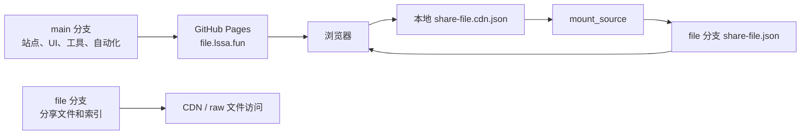
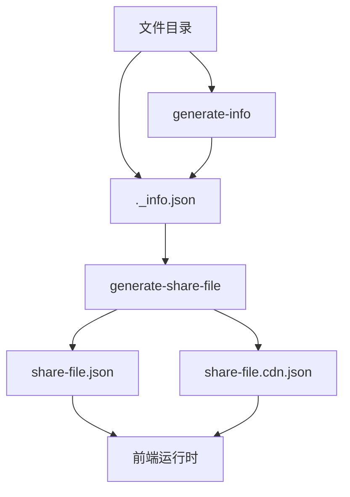

# 架构说明

本文档说明 ShareFile 的分支职责、数据流、前端加载流程和外部挂载模型。

## 总览

ShareFile 是一个静态文件分享站点。它不依赖后端数据库，而是把文件树和元数据编译成 JSON 索引，由浏览器在运行时加载。

核心组成：

| 组成           | 职责                    |
| -------------- | ----------------------- |
| `public/`      | GitHub Pages 发布目录   |
| `packages/ui`  | 前端应用源码            |
| `packages/cli` | Python 权威索引生成 CLI |
| `file` 分支    | 实际分享文件和文件索引  |

## 双分支模型



`main` 分支负责站点壳和工具链。`file` 分支负责实际分享文件。两者通过 `share-file.json` 和 `mount_source` 连接。

这种拆分的好处：

- 站点代码和分享文件可以独立变更。
- 文件更新不必触碰 UI 源码。
- 站点部署可以保持稳定，文件索引可以按需刷新。
- 外部仓库也可以按同样方式挂载进目录树。

## 数据生成链路



`generate-info` 负责目录级元数据，`generate-share-file` 负责生成前端一次性加载的扁平化索引。项目使用 Python CLI 执行这两个步骤，它是仓库内唯一的权威生成实现。

## 前端加载链路

生产构建默认加载：

```text
public/assets/data/share-file.cdn.json
```

开发模式默认加载：

```text
public/assets/data/share-file.json
```

构建脚本通过 `SHARE_FILE_NAME` 注入索引文件名。`packages/ui/scripts/esbuild.config.mjs` 中的规则是：

```text
dev=true  -> share-file.json
dev=false -> share-file.cdn.json
```

## 外部挂载模型

`mount_source` 可以放在目录节点上。前端发现后会：

1. 根据 `provider`、`repository`、`branch`、`access_cdn` 拼出外部索引 URL。
2. 加载外部仓库的 `share-file.json` 或 `share-file.cdn.json`。
3. 根据 `sub_path` 截取子树。
4. 重写节点 ID、父子关系和文件 URL。
5. 合并到本地挂载点。
6. 用 `localStorage` 缓存外部索引，刷新按钮可清理并重新加载。

外部节点会带上：

```json
{
  "source": "external",
  "mount_point": "/some/path"
}
```

UI 会根据这些字段给面包屑、列表项和链接标识外部来源。

## 包边界

| 包               | 边界                                         |
| ---------------- | -------------------------------------------- |
| `cli`            | Python 权威生成实现，读写文件系统并生成 JSON |
| `@share-file/ui` | 消费索引和静态资源，内部维护浏览器端数据协议 |

维护时优先保持这些边界。生成行为只改 `cli`，再同步契约测试和 UI。
