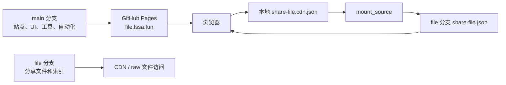
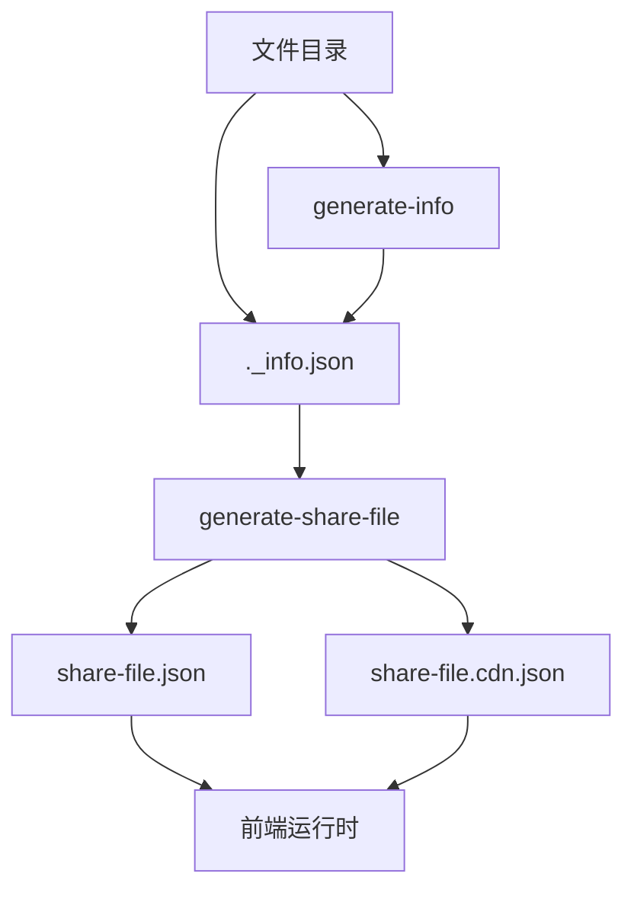

# 架构说明

本文档说明 ShareFile 的分支职责、数据流、前端加载流程和外部挂载模型。

## 总览

ShareFile 是一个静态文件分享站点。它不依赖后端数据库，而是把文件树和元数据编译成 JSON 索引，由浏览器在运行时加载。

核心组成：

| 组成           | 职责                    |
| -------------- | ----------------------- |
| `public/`      | GitHub Pages 发布目录   |
| `packages/ui`  | 前端应用源码            |
| `packages/cli` | Python 权威索引生成 CLI |
| `file` 分支    | 实际分享文件和文件索引  |

## 双分支模型


```mermaid
flowchart LR
  Main[main 分支<br/>站点、UI、工具、自动化] --> Pages[GitHub Pages<br/>file.lssa.fun]
  File[file 分支<br/>分享文件和索引] --> CDN[CDN / raw 文件访问]
  Pages --> Browser[浏览器]
  Browser --> LocalIndex[本地 share-file.cdn.json]
  LocalIndex --> Mount[mount_source]
  Mount --> FileIndex[file 分支 share-file.json]
  FileIndex --> Browser
```

`main` 分支负责站点壳和工具链。`file` 分支负责实际分享文件。两者通过 `share-file.json` 和 `mount_source` 连接。

这种拆分的好处：

- 站点代码和分享文件可以独立变更。
- 文件更新不必触碰 UI 源码。
- 站点部署可以保持稳定，文件索引可以按需刷新。
- 外部仓库也可以按同样方式挂载进目录树。

## 数据生成链路


```mermaid
flowchart TD
  Files[文件目录] --> Info[._info.json]
  Info --> GenerateShare[generate-share-file]
  Files --> GenerateInfo[generate-info]
  GenerateInfo --> Info
  GenerateShare --> ShareJson[share-file.json]
  GenerateShare --> CdnJson[share-file.cdn.json]
  ShareJson --> UI[前端运行时]
  CdnJson --> UI
```

`generate-info` 负责目录级元数据，`generate-share-file` 负责生成前端一次性加载的扁平化索引。项目使用 Python CLI 执行这两个步骤，它是仓库内唯一的权威生成实现。

## 前端加载链路

生产构建默认加载：

```text
public/assets/data/share-file.cdn.json
```

开发模式默认加载：

```text
public/assets/data/share-file.json
```

构建脚本通过 `__SHARE_FILE_NAME__` 注入索引文件名。`packages/ui/vite.config.ts` 中的规则是：

```text
mode=development | mode=local -> share-file.json
其余（含 mode=production）     -> share-file.cdn.json
```

前端为 Vue 3 + Vite 工程（路由、状态、领域层与插件体系的分层见 [frontend.md](frontend.md)）。

## 前端路由模型

站内目录使用 clean URL：

```text
https://file.lssa.fun/location/to/file
```

物理文件节点的复制链接和下载链接优先使用真实静态资源地址。因此这类链接可以被 `wget`、`curl` 等命令行工具直接下载：

```text
wget https://file.lssa.fun/softwares/applications/tools/generate-info-linux
```

外部挂载文件也遵循同样原则：前端会把它们重写成可直接访问的上游资源 URL（自有 CDN 域），而不是站内页面路由。

> [!IMPORTANT]
> 页面深链（`/location/to/file`）对**外挂**文件返回的是前端 HTML，取字节请用直链；完整清单见 `public/assets/data/files.jsonl`（构建期生成，含本地与外挂条目）。

旧版查询参数链接仍然兼容：

```text
https://file.lssa.fun/?path=/location/to/file
```

浏览器端会把旧链接规范化为 clean URL。由于 GitHub Pages 对不存在的静态路径会返回 `404.html`，`public/404.html` 会把访问路径临时写入 `sessionStorage`，再回到首页，由前端恢复为原始路径并渲染对应节点。

## 外部挂载模型

`mount_source` 可以放在目录节点上。前端发现后会：

1. 根据 `provider`、`repository`、`branch`、`access_cdn` 拼出外部索引 URL。
2. 加载外部仓库的 `share-file.json` 或 `share-file.cdn.json`。
3. 根据 `sub_path` 截取子树。
4. 重写节点 ID、父子关系和文件 URL。
5. 合并到本地挂载点。
6. 用 `localStorage` 缓存外部索引，刷新按钮可清理并重新加载。

外部节点会带上：

```json
{
  "source": "external",
  "mount_point": "/some/path"
}
```

UI 会根据这些字段给面包屑、列表项和链接标识外部来源。

### 准入清单与受限标记

挂载点的 `._info.json` 里可以再加两个字段，用来决定**外挂源的哪些路径根本不进站点**：

```json
{
  "mount_source": {
    "provider": "github",
    "repository": "owner/repo",
    "branch": "main",
    "sub_path": "/public",
    "allow_paths": ["/public/softwares"],
    "deny_paths": ["/public/softwares/internal"]
  }
}
```

匹配语义（**构建期与前端运行时共用同一套**，两侧都有纯函数与测试锁定）：

- 匹配对象是**外挂索引自身坐标系里的路径**，含 `sub_path` 前缀——上面例子里要写 `/public/softwares/...` 而不是 `/softwares/...`；挂载点在本地树里的位置不参与匹配。
- 命中判定是路径前缀：`path == rule` 或 `path.startswith(rule + "/")`，因此命中即覆盖整棵子树（`/a` 命中 `/a/b` 但不命中 `/ab`）。
- `deny_paths` 优先于 `allow_paths`；声明了非空 `allow_paths` 时，未命中的路径一律拒绝；两个清单都为空表示不限制。
- 元素会先规范化（补前导 `/`、去尾斜杠、忽略空串与非字符串、去重）；**`/` 视为整个源**（`deny_paths: ["/"]` = 该源什么都不放行）。
- 生效位置：构建期 `files.jsonl` 直接不含被拒条目；前端合并外挂索引时同样过滤，因此**索引与清单一致**。

节点上还可以加 `restricted: true`（放在目录或文件的 `._info.json` 里，会被 CLI 透传进 `share-file.json` / `share-file.cdn.json`）：

- 前端对它加「受限」标识，并**禁用三个复制动作**（复制直链 / 页面链接 / curl），目录级分享按钮同样禁用。
- **预览与播放不受限**——内容仍然可以看，只是站点不提供分享入口。
- ⚠️ **这不是安全边界**：本站是静态站点，任何人拿到 URL 都能直接访问。`restricted` 只是"不主动提供分享入口 + 明确提示"，真正的访问控制必须由托管层（如私有仓库 / 鉴权代理）承担。

## 包边界

| 包               | 边界                                         |
| ---------------- | -------------------------------------------- |
| `cli`            | Python 权威生成实现，读写文件系统并生成 JSON |
| `@share-file/ui` | 消费索引和静态资源，内部维护浏览器端数据协议 |

维护时优先保持这些边界。生成行为只改 `cli`，再同步契约测试和 UI。
