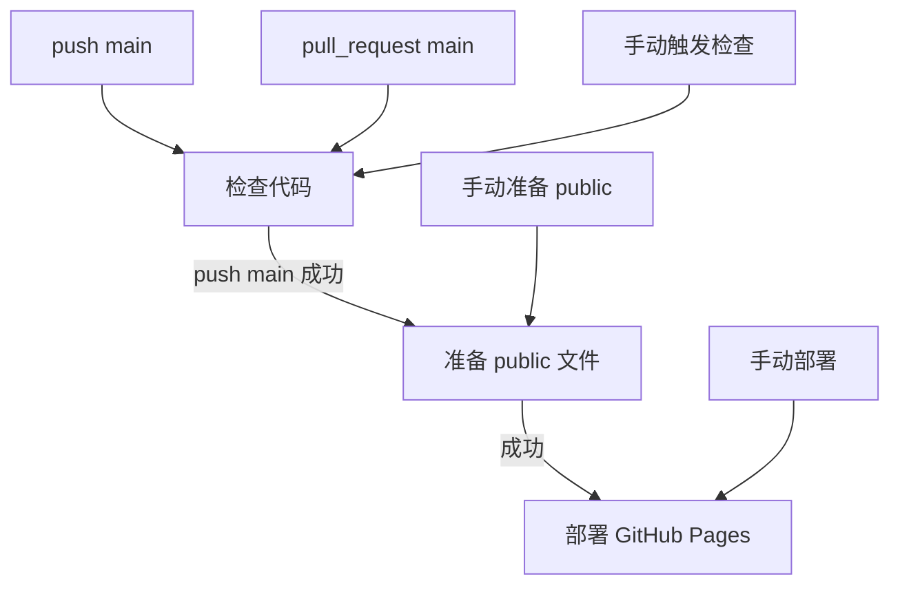

# GitHub Actions 工作流

本文档说明当前 GitHub Actions 的职责拆分、触发链路、权限和提交行为。

## 总览



三个 workflow：

| Workflow          | 文件                                         | 主要职责                          |
| ----------------- | -------------------------------------------- | --------------------------------- |
| 检查代码          | `.github/workflows/check-code.yml`           | 只读校验                          |
| 准备 public 文件  | `.github/workflows/prepare-public-files.yml` | 编译工具、生成索引、提交 `public` |
| 部署 GitHub Pages | `.github/workflows/deploy-github-pages.yml`  | 构建页面、上传 artifact、部署     |

## 检查代码

触发：

```text
push main
pull_request main
workflow_dispatch
```

忽略：

```text
README.md
```

权限：

```yaml
permissions:
  contents: read
```

执行命令：

```bash
pnpm install --frozen-lockfile
pnpm run verify
```

`verify` 包含：

```text
check -> lint -> format:check -> test:contract
```

这个 workflow 只做代码查验，不生成索引、不提交文件、不构建页面、不部署页面。

## 准备 public 文件

触发：

```text
检查代码 workflow_run completed
workflow_dispatch
```

自动链路只接受：

```text
检查代码成功
触发来源是 push
分支是 main
```

手动触发时会直接完整准备 `public`。

权限：

```yaml
permissions:
  contents: write
```

主要步骤：

```text
checkout 触发检查的提交
安装 pnpm / Node.js / Python
安装依赖
编译 Linux Python CLI
复制工具到 public/softwares/applications/tools/
运行 pnpm run generate
检查 public 是否变化
只提交 public
```

自动提交信息：

```text
ci(public): prepare generated public files [skip ci]
```

保留 `[skip ci]` 的原因：

- 生成物提交不需要重新触发检查链路。
- 部署由 `workflow_run` 触发，不依赖生成物提交的 push 事件。
- 避免自动提交导致重复运行。

提交范围被限制为：

```bash
git add public
```

不会把 PyInstaller 中间产物或其他工作区变更自动提交。

## 部署 GitHub Pages

触发：

```text
准备 public 文件 workflow_run completed
workflow_dispatch
```

权限：

```yaml
permissions:
  contents: read
  pages: write
  id-token: write
```

部署分两步：

```text
build-page
  -> checkout main 最新状态
  -> pnpm install
  -> pnpm run build
  -> upload-pages-artifact

deploy-page
  -> deploy-pages
```

部署时 checkout `main` 最新状态，是为了包含 `准备 public 文件` 运行期间可能提交的 generated commit。

## 并发控制

| Workflow          | concurrency group                        | 行为                        |
| ----------------- | ---------------------------------------- | --------------------------- |
| 检查代码          | `check-code-${{ github.ref }}`           | 同一 ref 只保留最新检查     |
| 准备 public 文件  | `prepare-public-files-${{ github.ref }}` | 同一 ref 只保留最新准备流程 |
| 部署 GitHub Pages | `deploy-github-pages`                    | 只保留最新部署              |

## 本地复现

检查代码：

```bash
pnpm run verify
```

准备索引：

```bash
pnpm run generate
```

构建页面：

```bash
pnpm run build
```

Python CLI 编译可参考：

```bash
cd packages/cli
pip install -r requirements.txt
pyinstaller build.spec
```

## 修改 workflow 时的注意事项

- PR workflow 不应写文件或提交文件。
- Pages 部署权限只应出现在部署 workflow。
- 生成物提交只应包含 `public`。
- `prepare-public-files.yml` 不应重新承担 `verify` 职责。
- `deploy-github-pages.yml` 不应运行 `pnpm run generate`。
- 如果未来加入 Windows/macOS 工具打包，应单独设计 matrix 和产物汇总。
