# Jellyfin 媒体库硬链接整理脚本

> **版本**：9.3 ｜ **作者**：LetsShareAll ｜ **许可**：MIT
>
> 自动化整理媒体库：通过 TMDB API 识别电影与电视剧，并用**硬链接**创建 Jellyfin 标准目录结构。支持 AI 辅助识别、全量镜像缓存、特典映射、季数偏移。

---

## 目录

1. [简介与功能](#1-简介与功能)
2. [依赖与环境要求](#2-依赖与环境要求)
3. [快速开始](#3-快速开始)
4. [命令行选项](#4-命令行选项)
5. [执行流程总览](#5-执行流程总览)
6. [TMDB API 调用详解](#6-tmdb-api-调用详解)
7. [执行判断详解](#7-执行判断详解)
8. [配置文件详解](#8-配置文件详解)
9. [输出目录结构](#9-输出目录结构)
10. [核心算法与公式](#10-核心算法与公式)
11. [日志与调试](#11-日志与调试)
12. [故障排除](#12-故障排除)
13. [许可证](#13-许可证)

---

## 1. 简介与功能

本脚本扫描源目录中的媒体文件，通过 **TMDB API** 识别其真实标题，并使用**硬链接**在目的目录创建 Jellyfin 规范的目录结构（不复制数据、不占用额外磁盘空间）。

### 功能特性

| 特性 | 说明 |
|---|---|
| 🎬 智能识别 | TMDB API 匹配电影与电视剧，支持多种文件名格式 |
| 🔗 硬链接整理 | 同一文件系统内零拷贝，省空间、省时间 |
| � 媒体类型智能判断 | 文件名无明确季集/年份特征时，**根据媒体目录内正片数量**判断电影/剧集（不依赖下载目录，合集种子可混合）；特典归属同理（媒体目录仅 1 个正片→电影特典跳过，多个→剧集特典 Season 00） |
| 🤖 AI 辅助识别 | 无法匹配/需甄别时调用 OpenAI 兼容接口（默认 DeepSeek-V4-Flash）纠正搜索词、**匹配甄别**（选候选 id + 季映射）、判定艺术家、学习特典映射；分批处理、失败可逆跳过 |
| 📚 持久化缓存 | 镜像 TMDB API 路径缓存全部请求数据到磁盘（`search/movie|tv/<hash>.json`、`tv/<id>.<lang>.json`、`tv/<id>/season/<n>.<lang>.json`、`movie/<id>.<lang>.json`），二次运行零外部请求；TTL：正常数据 30 天 / 查无此片 3 天；并发 flock 去重 |
| ⭐ 特典自动识别 | 识别 NCOP/NCED/Menu/PV/CM/Teaser/Preview 等特典并归入 Season 00；本地关键字 → keymap 多语言值（多键→多值）→ TMDB SEASON0 匹配；匹配用 `S00E{编号}`，未匹配用 `S00{类型}{编号}` |
| 🎬 电影特典跳过 | **不依赖下载目录**：媒体目录仅 1 个正片（如合集里的剧场版）时，其 SPs/CDs 特典视频不整理（TMDB/Jellyfin 不收录电影特典，避免误判为剧集特典） |
| 🎵 CD 音乐归 Music | 音频文件（flac/mp3 等）解析 CD 目录名，归入 `Music/歌手/专辑/曲目` |
| 🧮 季数偏移 | 处理 TMDB 季数与实际集数不符的剧集 |
| 📦 单文件分发 | 三个配置文件模板全部内嵌为常量，无需携带配套文件 |
| 🖥️ 跨平台 | 支持 Linux / macOS（BSD stat 兼容） |

### 处理流程（三阶段）

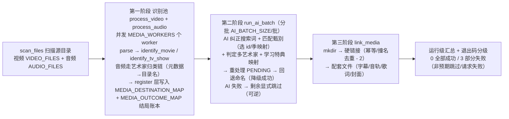

---

## 2. 依赖与环境要求

| 依赖 | 用途 | 安装示例 (Arch) |
|---|---|---|
| **Bash 4.0+** | 脚本运行环境 | 系统自带 |
| **curl** | 调用 TMDB / AI API | `sudo pacman -S curl` |
| **jq** | JSON 解析 | `sudo pacman -S jq` |
| **ffprobe** | 媒体探测（依赖检查） | `sudo pacman -S ffmpeg` |

> **重要**：源目录与目标目录必须在**同一文件系统**上，否则无法创建硬链接（脚本启动时会自动检测）。

---

## 3. 快速开始

### 3.1 首次运行（生成配置）

```bash
# 首次运行会提示创建配置模板
./media_organizer.sh /downloads /media
```

1. 若无 TMDB 密钥，会询问是否生成 `mo_env` 模板 → 输入 `y`
2. 在 `mo_config/mo_env` 中填写 `TMDB_API_RA_TOKEN`
3. 设置权限：`chmod 600 mo_config/mo_env`

### 3.2 干运行测试

```bash
# --dry-run 零持久化副作用：不创建链接、不写缓存、不写日志（网络请求照常但不落盘）
./media_organizer.sh --dry-run /downloads /media
```

### 3.3 正式运行

```bash
./media_organizer.sh /downloads /media
```

### 3.4 自动化模式（适合定时任务）

```bash
# 写入 /var/log，跳过无法处理的文件
./media_organizer.sh -a /downloads /media

# 配合 cron 定时运行
0 3 * * * /path/to/media_organizer.sh -a /downloads /media
```

---

## 4. 命令行选项

一次调用对应一种**模式（mode）**，由目录参数个数与 `--update-cache` 修饰标志共同决定：

| 模式形状 | 调用形式 | 行为 |
|---|---|---|
| `organize` | `[选项] <源目录> <目的目录>` | 正常整理（使用缓存） |
| `organize + update` | `--update-cache <源目录> <目的目录>` | 整理并强制重取对应缓存 |
| `cache-only` | `--update-cache <源目录>` | 仅更新缓存，不整理（更新完退出） |
| `list` | `--list-cache [关键词]` | 列出缓存条目（不接受目录参数） |

**选项**：

| 选项 | 说明 |
|---|---|
| `-a, --automated` | 自动化模式：写入日志文件，跳过无法处理的项目 |
| `--no-automated` | 取消自动化模式（覆盖环境变量/mo_env 设置） |
| `--dry-run` | 干运行：不创建链接、不写缓存、不写日志；网络请求照常但不落盘 |
| `--no-dry-run` | 取消干运行（覆盖环境变量/mo_env 设置） |
| `--refresh-cache` | 清空全部持久化缓存后执行（可与任意模式叠加） |
| `--update-cache` | 强制重取对应缓存条目（与 `--list-cache` 互斥） |
| `--list-cache [关键词]` | 列出缓存内容（哈希/类型/路径/参数/获取时间）；可选关键词按类型/路径/参数过滤 |
| `--src-dir <目录>` | 指定源目录（与位置参数互斥） |
| `--dest-dir <目录>` | 指定目的目录（与位置参数互斥） |
| `-h, --help` | 显示帮助信息（退出码 0） |
| `--version` | 显示版本号（退出码 0） |

**目录参数**：要么 2 个位置参数，要么 `--src-dir + --dest-dir` 成对指定，两种通道不可混用。`--` 之后的所有参数一律视为位置参数（目录名以 `-` 开头时使用）。

**语法**：选项可出现在位置参数之前或之后（permute）；带参数选项支持 `--opt=值` 与 `--opt 值` 两种形式（值以 `-` 开头时必须用 `=` 形式）。

**退出码**：0 = 全部成功；1 = 运行期错误；2 = 用法错误（未知选项、参数个数、模式冲突，附一行用法提示）；3 = 部分失败（非预期跳过 / 请求失败 / 链接失败 > 0，供 cron 感知）。

**冲突规则**（硬报错，不再静默忽略）：
- `--list-cache` 不接受目录参数，且不能与 `--update-cache` / `--dry-run` / `--automated` 同时使用
- 仅更新缓存（1 个目录）不接受 `--dry-run` / `--automated`（无链接可预览、无整理步骤）
- 0 个目录 + `--update-cache`：报错（缺源目录）

---

## 5. 执行流程总览

### 5.1 main() 生命周期

> 以下为**每一个原子化操作**。各识别函数内部细节见 [第 7 章](#7-执行判断详解)。

```mermaid
flowchart TD
    START(["main 脚本入口"]) --> PA["parse_args<br>索引遍历 逐项分发（permute 任意顺序）"]
    PA --> CASE{"case arg"}
    CASE -- "-a / --automated / --no-automated" --> OPT1["AUTOMATED=true/false"]
    CASE -- "--dry-run / --no-dry-run" --> OPT2["DRY_RUN=true/false"]
    CASE -- "--refresh-cache" --> OPT3["REFRESH_CACHE=true"]
    CASE -- "--update-cache" --> OPT4["UPDATE_CACHE=true"]
    CASE -- "--list-cache [过滤词] / --list-cache=过滤词" --> OPT5["LIST_CACHE=true<br>下一位非选项则作过滤词"]
    CASE -- "--src-dir / --dest-dir<br>（空格或 = 形式）" --> OPT6["收集命名目录"]
    CASE -- "--" --> DASH["后续均为位置参数"]
    CASE -- "-h / --help" --> HELP["show_help 打印帮助"]
    CASE -- "--version" --> VER["打印版本号"]
    CASE -- "未知 -*" --> UNK["_usage_error 报错<br>附用法提示"]
    CASE -- "其他" --> POS["收集为位置参数"]
    OPT1 --> PA
    OPT2 --> PA
    OPT3 --> PA
    OPT4 --> PA
    OPT5 --> PA
    OPT6 --> PA
    DASH --> PA
    HELP --> EXIT0([退出码 0])
    VER --> EXIT0
    UNK --> EXIT2([退出码 2])
    POS --> SHAPE["形状推导<br>通道互斥校验<br>list=0 目录 / cache-only=1 / organize=2"]
    SHAPE -- "冲突或个数不符" --> UNK
    SHAPE --> LC{"--list-cache?"}

    subgraph CONFIG["① 配置与初始化"]
        LC -- "是" --> ICD2["init_cache_dir<br>解析缓存路径 建子目录"]
        ICD2 --> LCL["cache_list 按过滤词列出<br>列出后退出"]
        LC -- "否" --> CFG["load_config"]
        CFG --> CFG1["find_config_file 定位 mo_env"]
        CFG1 --> CFG2["check_secure_file 校验 600 权限"]
        CFG2 --> CFG3["白名单键提取<br>从 MO_ENV_TEMPLATE 取键名集合<br>逐键 parse_config_key 读 mo_env<br>（文件永不执行）"]
        CFG3 --> CFG4["应用配置链<br>CLI > 环境变量 > mo_env > 默认值<br>扩展名/curl/缓存 TTL 等全部配置项"]
        CFG4 --> IC["init_colors 初始化色彩"]
        IC --> SA["select_auth 认证选择<br>（决策见 7.1）"]
        SA --> CD["check_dependencies"]
        CD --> CD1["依次验证 curl / jq / ffprobe"]
        CD1 -- "任一缺失" --> CDE["报错缺少命令"]
        CD1 -- "全部就绪" --> ISM["init_special_map 特典映射"]
        ISM --> ISM1["解析 SPECIAL_MAP_FILE 路径"]
        ISM1 --> ISM2{"文件存在?"}
        ISM2 -- "否" --> ISM3{"自动化模式?"}
        ISM3 -- "否" --> ISM4["交互创建默认 keymap<br>SPECIAL_KEYMAP_TEMPLATE 落盘"]
        ISM3 -- "是" --> ISM5["跳过创建"]
        ISM4 --> ISM6["load_special_map"]
        ISM5 --> ISM6
        ISM2 -- "是" --> ISM6
        ISM6 --> ISM7["第一遍：读 RAW_SPECIAL_MAP<br>值=数组或字符串引用"]
        ISM7 --> ISM8["第二遍：resolve_special_value<br>递归展开引用 → SPECIAL_MAP 统一 JSON 数组"]
        ISM8 --> ISO["init_season_offset 季偏移"]
        ISO --> ISO1["内嵌 SEASON_OFFSET_TEMPLATE<br>→ SEASON_OFFSET_MAP"]
        ISO1 --> ISO2["外部 season_offset.json 覆盖<br>（剧名小写 或 id: 键）"]
        ISO2 --> ISO3{"文件不存在?"}
        ISO3 -- "是" --> ISO4["由 SEASON_OFFSET_MAP 生成默认 JSON"]
        ISO3 -- "否" --> UPD
        ISO4 --> UPD{"cache-only?<br>--update-cache 且仅 1 个目录"}
        UPD -- "是" --> VCO["validate_directories<br>校验源目录存在可读"]
        VCO --> ICCO["init_cache_dir<br>（含 --refresh-cache 清空）"]
        ICCO --> UC["update_cache<br>扫描源目录唯一查询<br>强制重取覆盖缓存后退出"]
        UPD -- "否" --> VD["validate_directories<br>源目录存在可读<br>目的目录可写/可创建<br>（干运行不创建目录）"]
        VD --> CHSD{"干运行?"}
        CHSD -- "是" --> ICD
        CHSD -- "否" --> CHS["check_hardlink_support"]
        CHS --> CHS1["touch 源目录测试文件"]
        CHS1 --> CHS2["ln 测试到目的目录"]
        CHS2 -- "失败" --> CHSE["报错无法创建硬链接"]
        CHS2 -- "成功" --> CHS3["清理两个测试文件"]
        CHS3 --> ICD["init_cache_dir"]
        ICD --> ICD1["解析 CACHE_DIR 路径"]
        ICD1 --> ICD2A{"--refresh-cache?"}
        ICD2A -- "是" --> ICD3["cache_clear 清空缓存<br>（干运行跳过并警告）"]
        ICD2A -- "否" --> ICD4
        ICD3 --> ICD4["mkdir search/movie|tv tv movie 子目录<br>（干运行跳过）"]
        ICD4 --> TRAP["trap ERR 注册错误处理"]
        TRAP --> BANNER["打印版本/源/目的/运行模式"]
    end

    subgraph PIPE["② 三阶段流水线"]
        BANNER --> SF["scan_files 扫描"]
        SF --> SF1["find 视频扩展名文件<br>clean_name 去方括号后 sort"]
        SF1 --> SF2["填充 VIDEO_FILES 数组"]
        SF2 --> SF3["find 音频扩展名文件<br>填充 AUDIO_FILES"]
        SF3 --> PM["识别池 process_video + process_audio<br>并发 MEDIA_WORKERS 个 worker<br>子进程 emit 协议行 → 父进程合并登记<br>（register_* 写入目的映射+结局账本）"]
        PM --> PM1{"worker 处理单个文件<br>遍历 VIDEO_FILES / AUDIO_FILES"}
        PM1 -- "是" --> PM2["parse_media_filename<br>→ type|title|year|season|episode|fragment<br>（决策见 7.2）"]
        PM2 --> PM3{"type 分支"}
        PM3 -- "movie" --> PM4["identify_movie 搜索电影<br>（见 6/7）"]
        PM3 -- "tv" --> PM5["identify_tv_show 搜索剧集<br>（见 7.3/7.4）"]
        PM3 -- "skip" --> PM6["电影特典跳过不整理<br>自动化写 SKIP_LOG_FILE"]
        PM3 -- "unknown" --> PM7["PENDING_AI_SEARCH 记录<br>VIDEO_DEST_MAP=PENDING_AI"]
        PM4 --> PM8{"dest 非空?"}
        PM5 --> PM8
        PM6 --> PM1
        PM7 --> PM1
        PM8 -- "是" --> PM9["VIDEO_DEST_MAP[目标|子目录|文件名]"]
        PM8 -- "否" --> PM10["VIDEO_DEST_MAP=PENDING_AI"]
        PM9 --> PM1
        PM10 --> PM1
        PM1 -- "结束" --> PAUD["process_audio 音频处理"]
        PAUD --> PAUD1["向上定位 CD 目录<br>（[日期]/专辑/格式特征）"]
        PAUD1 --> PAUD2["parse_cd_dir 解析 歌手|专辑"]
        PAUD2 --> PAUD3["目标 Music/歌手/专辑[/子碟] 入 MAP"]
        PAUD3 --> RAB{"AI 密钥存在 且 有待处理项?"}
        RAB -- "否" --> LM
        RAB -- "是" --> AIB["run_ai_batch 第二阶段<br>（见 7.5）"]
        AIB --> AIB1["ai_batch_request 一次合并请求<br>search + special"]
        AIB1 --> AIB2["构造输入 JSON → curl AI 接口"]
        AIB2 --> AIB3["解析：search 追加词/年/类别<br>special 写 keymap 文件+内存"]
        AIB3 --> AIB4{"遍历 PENDING_AI 还有?"}
        AIB4 -- "是" --> AIB5["parse 重识别<br>AI 纠正词重搜<br>media_type 定 movie/tv"]
        AIB5 --> AIB6{"识别成功?"}
        AIB6 -- "是" --> AIB7["记录目标路径"]
        AIB6 -- "否" --> AIB8["回退命名（原始标题）"]
        AIB7 --> AIB4
        AIB8 --> AIB4
        AIB4 -- "结束" --> LM["link_media 第三阶段硬链接<br>（见 7.6）"]
        LM --> LM1{"遍历 VIDEO_DEST_MAP 还有?"}
        LM1 -- "是" --> LM2{"目标路径有效?"}
        LM2 -- "否" --> LMSKIP["skip++"]
        LM2 -- "是" --> LM3["mkdir -p 目标目录"]
        LM3 -- "失败" --> LMSKIP
        LM3 -- "成功" --> LM4["hardlink_or_dryrun 主文件"]
        LM4 -- "成功" --> LM5["处理配套文件<br>base_name.* → is_companion<br>→ 保语言后缀 → 硬链接"]
        LM4 -- "失败" --> LMSKIP
        LM5 --> LM1
        LMSKIP --> LM1
        LM1 -- "结束" --> SUM["汇总输出<br>成功 hardlink_count 个<br>跳过 skip_count 个"]
    end
```

### 5.2 配置优先级

**值优先级**（同一个配置键取最高来源）：**CLI > 环境变量 > mo_env 文件 > 内置默认值**。CLI 显式设置（含 `--no-*` 反选）覆盖一切；mo_env 仅读取白名单键（键名集合取自内嵌模板），文件内容永不执行。

**配置文件查找**遵循严格的优先级（这是"文件在哪里"的问题，与上面的值优先级正交）：

$$P = \underbrace{\text{环境变量}}_{1^\text{st}} \succ \underbrace{\text{执行目录}\ (PWD)}_{2^\text{nd}} \succ \underbrace{\text{脚本目录}\ (SCRIPT\_DIR)}_{3^\text{rd}}$$

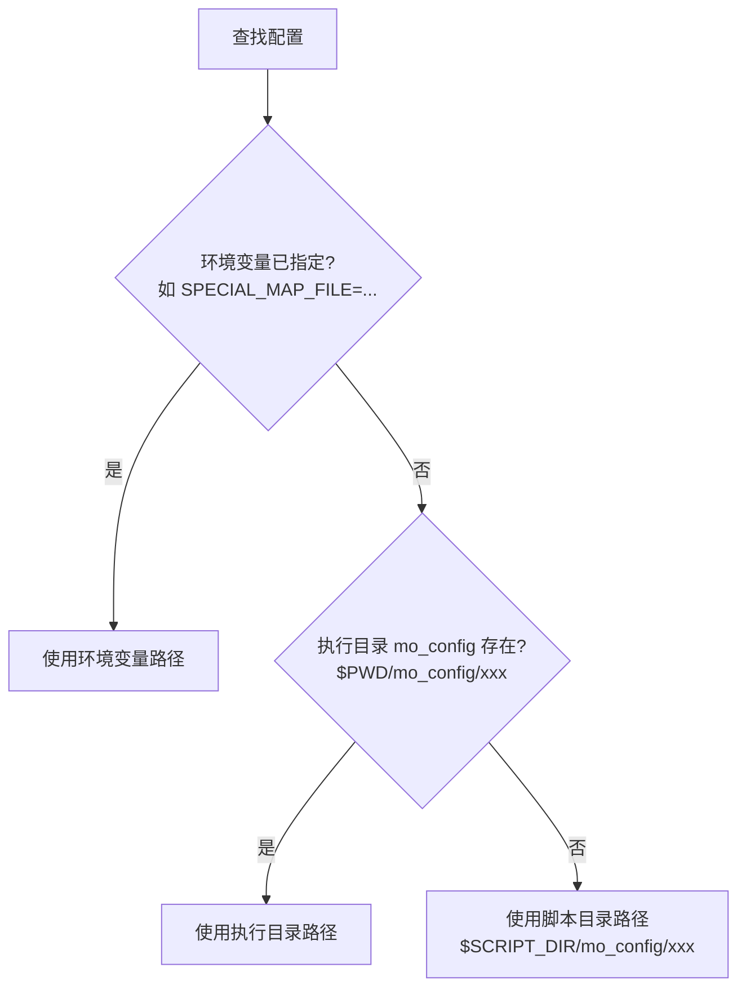

**三个配置文件的默认位置**（优先级：环境变量 > 执行目录 > 脚本目录）：

| 文件 | 执行目录 | 脚本目录 |
|---|---|---|
| `mo_env` | `$PWD/mo_config/mo_env` | `$SCRIPT_DIR/mo_config/mo_env` |
| `mo_special_keymap.json` | `$PWD/mo_config/mo_special_keymap.json` | `$SCRIPT_DIR/mo_config/mo_special_keymap.json` |
| `season_offset.json` | `$PWD/mo_config/season_offset.json` | `$SCRIPT_DIR/mo_config/season_offset.json` |
| 缓存 `mo_cache` | `$PWD/mo_cache` | `$SCRIPT_DIR/mo_cache` |

---

## 6. TMDB API 调用详解

> 脚本通过 TMDB v3 API 识别电影与剧集。所有请求经统一的 `tmdb_api` 函数发起，配置项控制重试/超时/延迟。

### 6.1 认证与基础函数 `tmdb_api`

- **基础 URL**：`https://api.themoviedb.org/3`（常量 `TMDB_API_BASE_URL`）
- **认证方式**（二选一）：
  - `TMDB_API_RA_TOKEN`（优先）：请求头 `Authorization: Bearer <token>`
  - `TMDB_API_KEY`：URL 参数 `api_key=<key>`
- **固定参数**：`language=<TMDB_LANG>`（默认 `zh-CN`，影响返回的中/英文名）
- **curl 行为**：`GET`、重试 `TMDB_CURL_RETRY` 次、连接超时 `TMDB_CURL_CONNECT_TIMEOUT`、最大时长 `TMDB_CURL_MAX_TIME`、`-fS`（HTTP 错误时返回非零）
- **返回值**：JSON 响应写入 **stdout**；失败返回非零退出码并记录 `[错误] TMDB 请求失败`

```bash
# 调用示例（脚本内部）
tmdb_api "/search/movie" "query=Inception" "year=2010"
```

### 6.2 所有调用点一览

| 端点 | 用途 | 附加参数 | 返回的关键字段 |
|---|---|---|---|
| `/search/movie` | 电影搜索 | `query`、`year`（可选） | `results[0].id/title/release_date` |
| `/search/tv` | 剧集搜索 | `query` | `results[0].id/name/first_air_date` |
| `/movie/{id}` | 电影详情（识别后补调） | - | `title/release_date/overview` 等完整信息 |
| `/tv/{id}` | 剧集详情 | - | `number_of_seasons` |
| `/tv/{id}/season/1` | 第一季集数 | - | `episodes` 数组长度（仅季偏移需要） |
| `/tv/{id}/season/0` | 特典季数据 | - | `episodes[].episode_number/name` |
| `/tv/{id}/season/{N}` | 第 N 季集名 | - | `episodes[].name` |

> 注：AI 辅助阶段会重复调用 `/search/movie`、`/search/tv` 用 AI 纠正后的搜索词重新搜索。

### 6.3 调用顺序（识别一个剧集文件时）

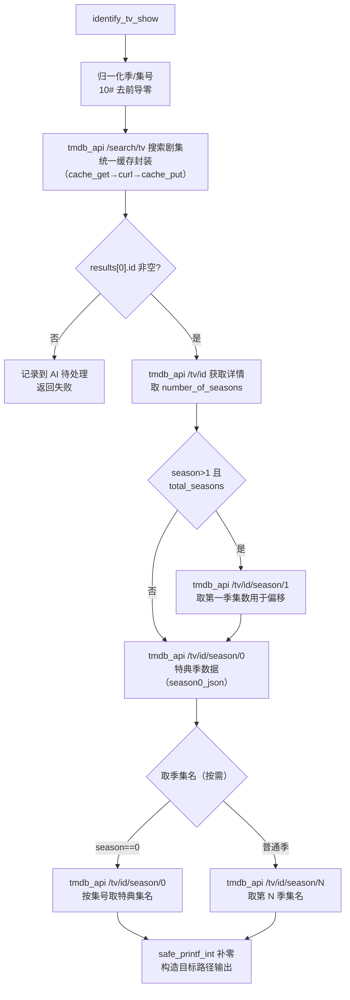

### 6.4 缓存方案（v9.0：镜像 TMDB API 路径）

> v9.0 将缓存方案完全重做：**缓存目录结构镜像 TMDB API 端点路径**，一切请求数据（搜索、详情、各季）全量缓存，二次运行零外部请求。

**缓存目录结构**（默认 `mo_cache/`）：

```
mo_cache/
├── search/
│   ├── movie/<md5(query|year|lang)>.json    # 搜索缓存（包裹格式）
│   └── tv/<md5(query|lang)>.json
├── tv/
│   ├── <id>.<lang>.json                     # 剧集详情（原始 JSON；语言段随 TMDB_LANG）
│   └── <id>/season/<n>.<lang>.json          # 每季数据（含 season 0 特典季）
└── movie/
    └── <id>.<lang>.json                     # 电影详情（原始 JSON）
```

**搜索缓存文件格式**（包裹 JSON，含查询参数与获取时间）：

```json
{
  "query": "Sword Art Online II",
  "year": "",
  "lang": "zh-CN",
  "fetched_at": 1786169195,
  "empty": false,
  "data": { "...TMDB 原始响应..." }
}
```

**核心机制**：

- **`tmdb_api` 统一封装**：所有 TMDB 请求必经此函数。先 `cache_get` 查缓存——命中直接返回；未命中加锁后 `curl` 请求，成功后 `cache_put` 落盘。
- **`cache_key`**：将查询参数拼成 `query=xxx&lang=zh-CN` 形式（末尾固定加 `&lang`）。
- **`cache_path`**：搜索请求用 key 的 md5 哈希作文件名（`search/movie|tv/<hash>.json`）；详情/季请求从 key 中提取 id 作路径并**附加语言段**（`tv/<id>.<lang>.json`、`tv/<id>/season/<n>.<lang>.json`、`movie/<id>.<lang>.json`）——切换 `TMDB_LANG` 自动 miss 重新拉取。
- **并发去重（flock + 双检）**：识别池多 worker 可能同时 miss 同一查询——`tmdb_api` 未命中后用 `flock` 跨进程互斥（锁文件在 `/tmp`），锁内**双检**缓存：等待者直接命中先写者的结果，同一查询只发一次请求。
- **`cache_put_empty`**：搜索**空结果**（`results:[]`）写 `empty:true` 哨兵（3 天短 TTL）——查无此片在新片出现后自动重新搜索；请求失败（重试耗尽）不写哨兵，下次运行重试。
- **过期机制**：普通缓存 `CACHE_TTL_DAYS`（默认 30 天）、空哨兵 `CACHE_EMPTY_TTL_DAYS`（默认 3 天），超时按 mtime 判定后重新请求。空哨兵在 TTL 内由 `cache_empty_fresh` 识别并跳过重复请求（不重新 curl），TTL 过后才重试。
- **季号归一化**：识别流程将 `parse_media_filename` 产出的季/集号（如 `S01E05` 的 `01`/`05`）归一化为无前导零十进制（`1`/`5`），保证季缓存路径 `season/1.json` 与 `--update-cache` 的整数循环一致，缓存互可命中。
- **原子写**：`cache_put` 先写临时文件再 `rename`，避免并发/中断产生半截 JSON。
- **相同标题分类型**：同一标题（如某作品既有剧场版又有 TV 版）会分别缓存 `search/movie` 与 `search/tv`，识别时各取所需。
- 请求间延迟 `TMDB_DELAY` 秒，避免触发限流（约 4 请求/秒）。

**缓存维护命令**：

```bash
# 查看缓存（哈希/类型/路径/参数/获取时间），可按关键词过滤
./media_organizer.sh --list-cache
./media_organizer.sh --list-cache "tv"

# 仅更新缓存（1 个目录）：扫描源目录所有唯一查询，强制重取并覆盖缓存后退出
./media_organizer.sh --update-cache /downloads

# 整理并强制重取（2 个目录）：整理流水线内对处理的条目不信任陈旧缓存
./media_organizer.sh --update-cache /downloads /media

# 清空缓存后运行
./media_organizer.sh --refresh-cache /downloads /media
```

> **为何不再用内存缓存 + 同步文件**：v8 的 `SHOW_CACHE`/`SEASON_CACHE` 在识别函数（子 shell）内直接赋值不传播回父 shell，依赖 `CACHE_SYNC_FILE` 同步文件绕行，且无法缓存全部请求数据。v9.0 改为纯磁盘镜像缓存，天然规避子 shell 问题，且搜索/详情/季数据全量保存。

---

## 7. 执行判断详解

> 本章是脚本的**决策树**，展示每一个关键分支判断。箭头上的文字为判断条件，菱形为判断节点。

### 7.1 TMDB 认证选择

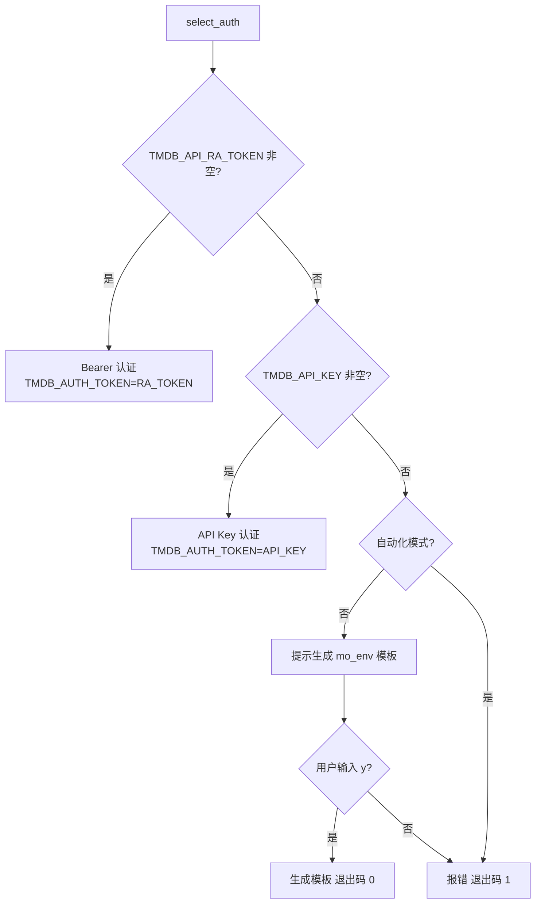

### 7.2 文件类型识别（parse_media_filename）

脚本按**顺序**尝试匹配，第一个命中的格式生效。所有格式均不命中时，**不再默认判为电影**，而是根据**媒体目录内正片数量**判断（v9.3，不依赖下载目录——合集种子可能把剧场版电影与剧集混放）。

#### 7.2 主决策树（顺序匹配）

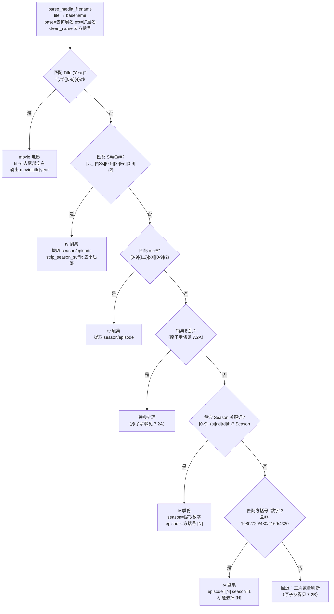

#### 7.2A 特典识别与处理（原子步骤）

> 特典识别**优先于季份**（如 `Show 2nd Season [Menu01]` 先识别为特典 Season 00）。特典词在**方括号标记内**匹配（避免误判标题），也支持**父目录**判断（文件位于 `SPs/`、`CDs/`、`Bonus/` 等）。

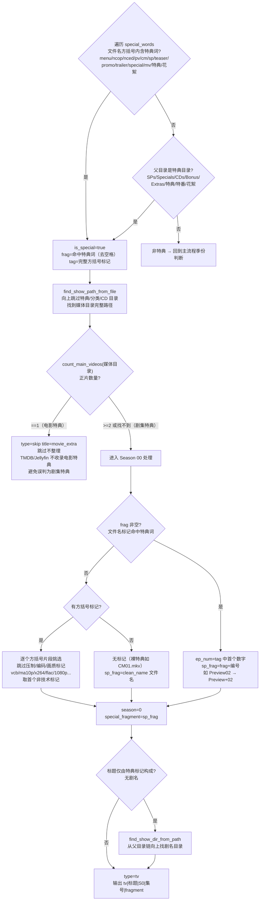

#### 7.2B 正片数量判断（回退，v9.3）

> **不依赖下载目录**。仅统计"正片"：跳过 `SPs/CDs/Scans/Fonts/特典` 等子目录；扩展名取 `VIDEO_EXTS`（**mka 是纯音频容器，不计入**）。结果按媒体目录缓存（`MAIN_COUNT_CACHE`），避免重复扫描。

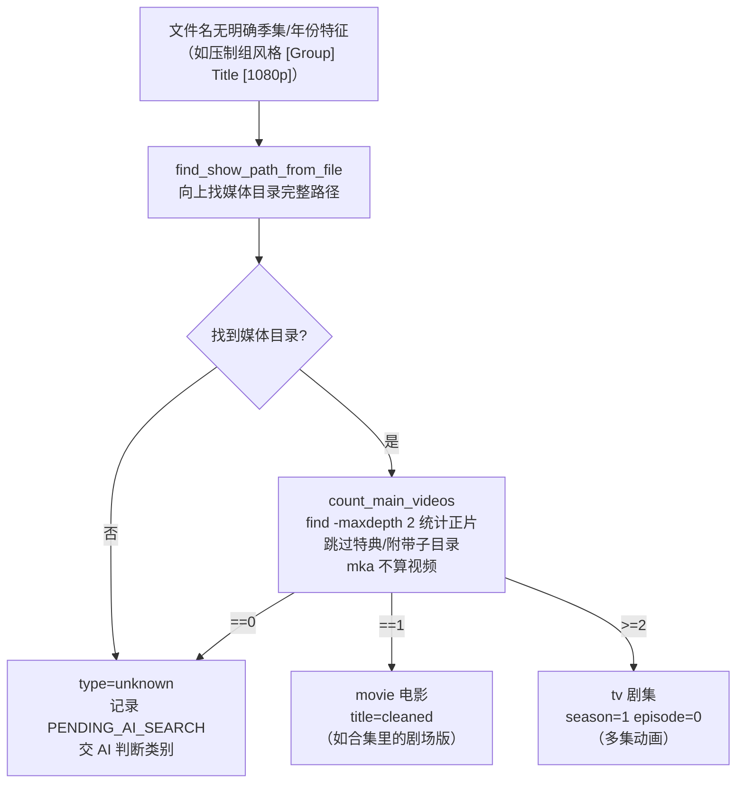

**支持的文件名格式**：

| 格式 | 示例 | 识别结果 |
|---|---|---|
| 电影（带年份） | `Inception (2010).mkv` | movie |
| 剧集 SxxEyy | `Breaking Bad S01E01.mkv` | tv S01E01 |
| 剧集 #x## | `Show 1x05.mkv` | tv S01E05 |
| 特典 | `Show [NCOP].mkv` / `Show [Menu01].mkv` / `CM01.mkv`（在 SPs 目录） | 剧集特典 S00；媒体目录仅 1 正片 → **电影特典跳过** |
| 季份 | `Show 2nd Season [01].mkv` | tv 季份 |
| 方括号集号 | `Show [03].mkv` | tv S01E03 |
| 其他（无明确特征） | `Random Movie.mkv` / `[Group] Show [1080p]` | 由媒体目录正片数量判断：**1→movie**，**≥2→tv**，**0/无目录→unknown（AI）** |

### 7.3 季数偏移判断（identify_tv_show）

处理 TMDB 季数与实际不符的情况。以下为**每一个原子化操作**：

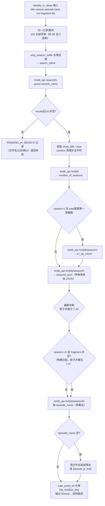

#### 7.3A 季偏移决策（原子步骤）

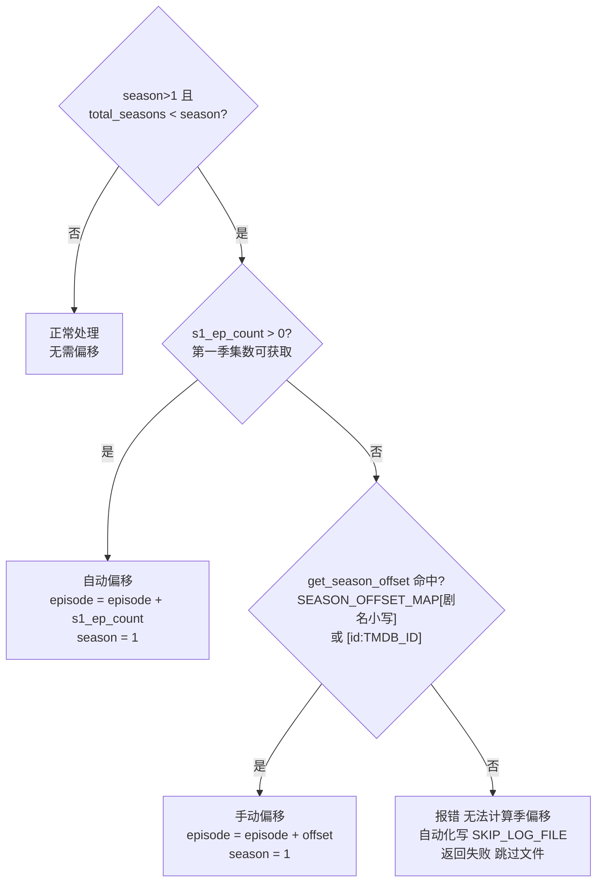

**示例**：资源实际为 `S01E23`，但 TMDB 只有一季（23 集/季），配置 `{"jujutsu kaisen": 23}` 后，实际 `S02E01` 被映射为：

$$E_{\text{new}} = E_{\text{old}} + O = 1 + 23 = 24 \quad\Rightarrow\quad \text{S01E24}$$

### 7.4 特典匹配判断（Season 00）

> **前置归属判断**（v9.3，不依赖下载目录）：特典文件先由 `parse_media_filename` 判定归属——媒体目录仅 1 个正片 → **电影特典**（`type=skip`，直接跳过不整理，TMDB/Jellyfin 不收录电影特典）；多个正片 → **剧集特典**（进入本节的 Season 00 处理）。以下为剧集特典的**每一个原子化操作**：

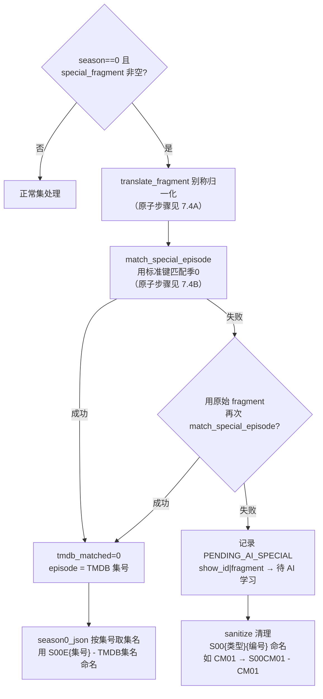

> 特典匹配使用**多语言别称**：候选词 = 原始片段 + 去数字核心 + keymap 值数组中的全部多语言值（中文/日文/英文缩写），逐一 `contains`（忽略大小写）匹配 TMDB 季 0 的集名。

#### 7.4A translate_fragment（原子步骤）

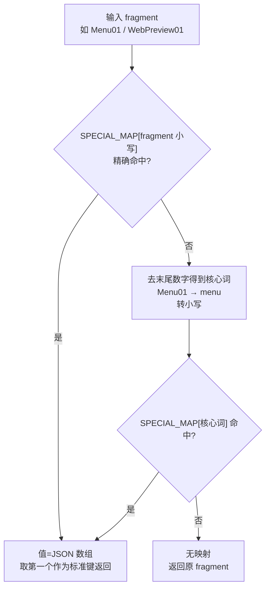

#### 7.4B match_special_episode（原子步骤）

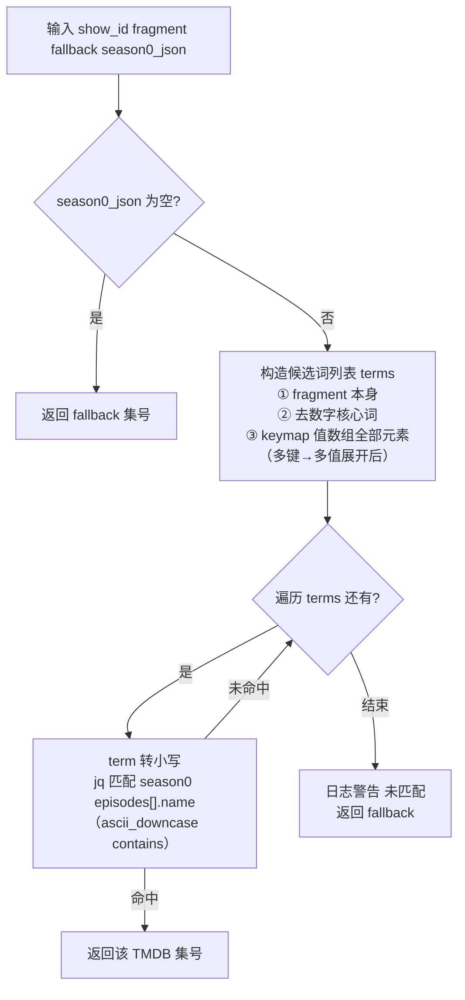

**特典命名规则**：

| 情况 | 命名 | 示例 |
|---|---|---|
| TMDB 特典集匹配成功 | `S00E{集号} - TMDB集名.ext` | `S00E01 - 迷你动画「猫猫的独语」第1话：白粉.mkv` |
| 未匹配（有编号） | `S00{类型}{编号}.ext` | `S00CM01.mkv`、`S00Menu01.mkv`、`S00PV01.mkv` |
| 未匹配（无编号） | `S00{类型}.ext` | `S00NCED.mkv`、`S00NCOP.mkv` |

> `S00E{编号}` 仅用于 TMDB 能匹配的特典集；未匹配的特典用 `S00{类型}{编号}` 命名，避免占用正常特典编号、干扰 Jellyfin 刮削。

### 7.5 AI 批处理判断（run_ai_batch）

AI 分批处理四类待办：**搜索词纠正/类别判断**（`PENDING_AI_SEARCH`）、**特典映射学习**（`PENDING_AI_SPECIAL`）、**艺术家判定**（`PENDING_AI_ARTIST`）、**匹配甄别**（`PENDING_AI_MATCH`）。每批 `AI_BATCH_SIZE` 条，`AI_MAX_CALLS` 为批次上限。以下为**每一个原子化操作**：

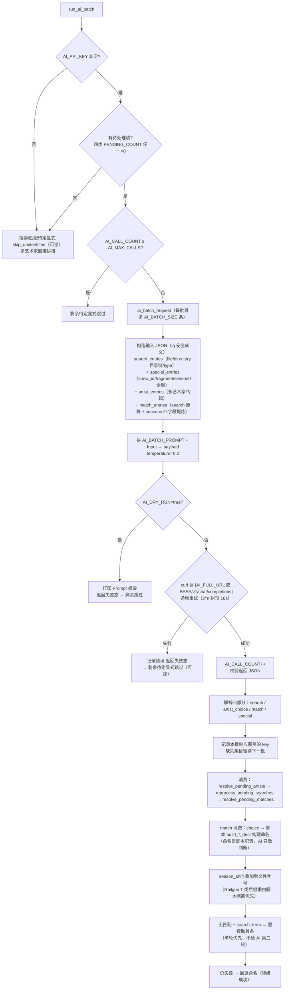

> **AI 失败语义**：请求失败/非 JSON/干运行/达上限 → 剩余搜索与匹配待定**显式跳过（可逆）**——下次运行自动重试，与无 AI 密钥语义统一；多艺术家待定直接拼接（信息不丢）。
>
> **AI 成本控制**：`AI_BATCH_SIZE`（默认 50）条/批，`AI_MAX_CALLS`（默认 10）为**批次上限**；`AI_DRY_RUN=true` 时可测试而不产生费用。AI 学到的特典映射会**持久化**到 `mo_special_keymap.json`（值数组合并去重），下次运行直接生效。

### 7.6 硬链接处理判断（link_media）

> **v9.1 起不再做 `.bak` 备份**——遗留的 `.bak_*` 会被 Jellyfin 当作媒体扫描干扰刮削；目标已存在时**直接替换**（先删旧目标再建硬链接）。以下为**每一个原子化操作**：

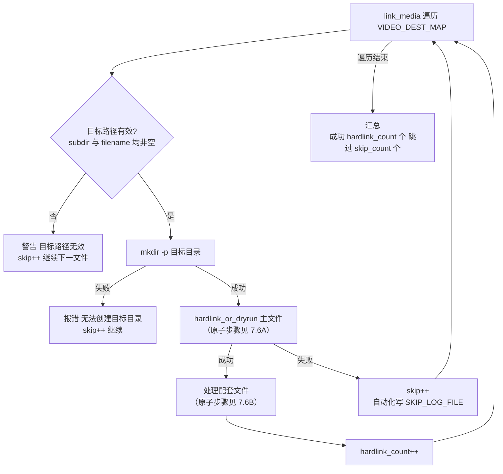

#### 7.6A hardlink_or_dryrun（原子步骤）

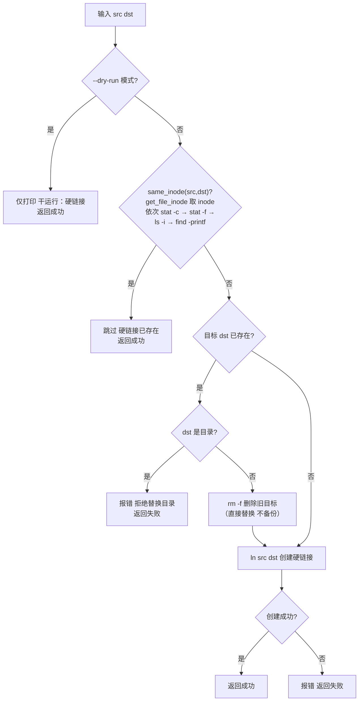

#### 7.6B 配套文件处理（原子步骤）

> 配套文件（字幕 `.srt/.ass`、音轨 `.mka` 等）**跟随其主视频**一起硬链接。同名或语言标签命名均识别。

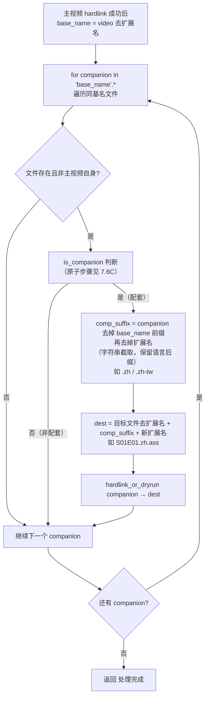

#### 7.6C is_companion（原子步骤）

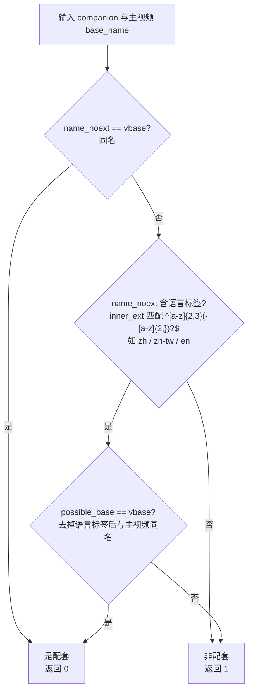

---

## 8. 配置文件详解

### 8.1 `mo_env`（主配置文件）

所有配置项及其默认值（优先级：**环境变量 > mo_env > 脚本默认值**）：

| 配置项 | 默认值 | 说明 |
|---|---|---|
| `TMDB_API_KEY` | （空，必填之一） | TMDB v3 API Key |
| `TMDB_API_RA_TOKEN` | （空，必填之一） | TMDB Read Access Token（推荐） |
| `TMDB_LANG` | `zh-CN` | API 查询语言 |
| `TMDB_DELAY` | `1` | 请求间延迟（秒），防限流 |
| `TMDB_CURL_RETRY` | `3` | curl 重试次数 |
| `TMDB_CURL_CONNECT_TIMEOUT` | `10` | 连接超时（秒） |
| `TMDB_CURL_MAX_TIME` | `30` | 请求最大时长（秒） |
| `VIDEO_EXTS` | `mp4,mkv,avi,mov,...` | 视频扩展名 |
| `AUDIO_EXTS` | `mp3,flac,aac,ogg,...` | 音频扩展名 |
| `SUB_EXTS` | `srt,ass,ssa,sub,...` | 字幕扩展名 |
| `CACHE_DIR` | `mo_cache` | 缓存目录（镜像 TMDB API 路径） |
| `CACHE_TTL_DAYS` | `30` | 缓存有效期（天），超过后重新请求 |
| `CACHE_EMPTY_TTL_DAYS` | `3` | 空结果哨兵有效期（天），超过后重新请求 |
| `SPECIAL_MAP_FILE` | `mo_config/mo_special_keymap.json` | 特典映射文件 |
| `SEASON_OFFSET_FILE` | `mo_config/season_offset.json` | 季偏移文件 |
| `COLOR_OUTPUT` | `true` | 彩色输出开关 |
| `DEBUG_LEVEL` | `0` | 调试级别（0/1/2） |
| `AI_API_KEY` | （空，留空禁用 AI） | AI API 密钥 |
| `AI_BASE_URL` | `https://api.openai.com` | AI API 基础 URL |
| `AI_FULL_URL` | （空） | AI 完整端点（默认 `{AI_BASE_URL}/v1/chat/completions`） |
| `AI_MODEL` | `gpt-3.5-turbo` | AI 模型 |
| `AI_MAX_CALLS` | `10` | 单次最多 AI 调用次数 |
| `AI_DRY_RUN` | `false` | AI 干运行（不产生费用） |
| `AI_CURL_RETRY` | `3` | AI curl 重试次数 |
| `AI_CURL_CONNECT_TIMEOUT` | `10` | AI 连接超时（秒） |
| `AI_CURL_MAX_TIME` | `30` | AI 请求最大时长（秒） |
| `LOG_FILE` | `/var/log/media_organizer.log` | 自动化日志路径 |
| `SKIP_LOG_FILE` | `/var/log/media_organizer_skip.log` | 跳过记录日志路径 |
| `MEDIA_WORKERS` | `4` | 识别池并发数（1-8；并发高时建议增大 `TMDB_DELAY`） |
| `FOLDER_MOVIES` | 跟随系统语言 | 目的目录"电影"根名（zh locale 默认 `电影`） |
| `FOLDER_SHOWS` | 跟随系统语言 | 目的目录"剧集"根名 |
| `FOLDER_MUSIC` | 跟随系统语言 | 目的目录"音乐"根名 |
| `FOLDER_MUSICVIDEOS` | 跟随系统语言 | 目的目录"音乐视频"根名（官方库名 `MusicVideos`） |
| `FOLDER_UNKNOWN` | 跟随系统语言 | 未知艺术家/标题占位名 |
| `SKIP_HARDLINK_CHECK` | `false` | 跳过硬链接检查（不建议） |

### 8.2 `mo_special_keymap.json`（特典映射）

**格式**：**键为文件中的关键字符串（本地特典关键字），值为 TMDB 特典名中能匹配该关键字的字符串数组（多键→多值，可含多语言）**。

值可以是：
- **JSON 数组**：直接的多语言匹配值，如 `["Menu", "菜单", "メニュー"]`。
- **字符串（引用另一键）**：复用其他键的数组，实现多键共享同一组值。不同压制组的特典命名不同（`Menu01`/`Menu 01`/`MENU01`），但对应同一 TMDB 关键字，用引用避免重复定义。

```json
{
  "menu": ["Menu", "菜单", "メニュー"],
  "menu01": "menu",
  "menu_1": "menu",
  "preview": ["Preview", "预告片", "予告"],
  "webpreview": "preview"
}
```

- **键**：从文件名解析出的特典关键字（可带编号，如 `Menu01`；也常用去编号的核心词如 `menu`）。
- **值**：TMDB SEASON0 特典集中能匹配该关键字的字符串数组（英文/中文/日文等多语言均可），或引用其他键的数组。

**识别/匹配流程**：
1. 从文件名提取特典片段（如 `Menu01`）→ 转小写查 keymap（先精确，再按去数字核心词 `menu` 查）；命中后引用值会递归展开为数组。
2. 命中后用**数组中的每一个值**去该剧集 TMDB `season/0` 的 `episodes[].name` 做 `contains`（忽略大小写）匹配——任一值命中即匹配该特典集。
3. 匹配成功 → 用 `S00E{编号} - TMDB集名` 命名；失败 → 回退 `S00{类型}{编号}`。

> AI 学习也会写入此文件：AI 判定本地关键字对应 SEASON0 的哪些特典名（多语言）后，合并写入值数组（去重）。
> 缺失时，脚本在用户确认下用内嵌的 `SPECIAL_KEYMAP_TEMPLATE` 常量自动生成。

### 8.3 `season_offset.json`（季数偏移）

**格式**：键为剧名（小写）或 `id:TMDB_ID`，值为第一季的集数：

```json
{
  "jujutsu kaisen": 23,
  "demon slayer": 26,
  "one piece": 130,
  "id:109620": 23
}
```

> 缺失时，脚本用内嵌的 `SEASON_OFFSET_TEMPLATE` 常量自动生成 14 个内置默认值。

---

## 9. 输出目录结构

脚本在目标目录创建 Jellyfin 规范的结构：

```text
/media
├── Movies/
│   └── Inception (2010)/
│       └── Inception (2010).mkv
├── Shows/
│   ├── Breaking Bad (2008)/
│   │   └── Season 01/
│   │       ├── S01E01 - Pilot.mkv
│   │       └── S01E01 - Pilot.srt              ← 伴随文件
│   └── Some Anime (2020)/
│       └── Season 00/
│           ├── S00E01 - 迷你动画「猫猫的独语」第1话：白粉.mkv   ← TMDB 匹配特典（S00E 编号）
│           ├── S00CM01 - CM01.mkv              ← 未匹配特典（S00{类型}{编号}）
│           └── S00Menu01 - Menu01.mkv
└── Music/                                     ← CD 音乐（flac/mp3）
    └── 平井大/
        └── 幸せのレシピ/
            └── 01. 幸せのレシピ.flac
```

**命名规则**：

| 类型 | 规则 |
|---|---|
| 电影 | `Movies/标题 (年份)/标题 (年份).扩展名` |
| 剧集 | `Shows/标题 (年份)/Season NN/S{季}E{集} - 集名.扩展名` |
| 特典（TMDB 匹配） | `Shows/标题 (年份)/Season 00/S00E{集号} - TMDB集名.扩展名` |
| 特典（未匹配） | `Shows/标题 (年份)/Season 00/S00{类型}{编号} - 原片段.扩展名`（如 `S00CM01`、`S00Menu01`、`S00PV01`） |
| 伴随文件 | 与视频同名，保留语言标签（`.zh.srt`、`.jp.ass` 等） |

> **要点**：文件名**不含剧集名**——Jellyfin 通过父目录（`Shows/标题 (年份)/`）识别剧集，不影响刮削。`S00E{编号}` 仅用于 TMDB 能匹配的特典集；未匹配的特典用 `S00{类型}{编号}` 区分，避免干扰正常特典编号。

---

## 10. 核心算法与公式

### 10.1 季数偏移

设实际集号为 $E$、季号为 $S$，TMDB 第一季集数为 $S_1$：

- **自动偏移**（TMDB 有第一季数据时）：

$$E' = E + S_1,\qquad S' = 1$$

- **手动偏移**（来自 `season_offset.json`，偏移值为 $O$）：

$$E' = E + O,\qquad S' = 1$$

### 10.2 编号格式化

集号/季号统一补零为两位：

$$\text{pad2}(n) = \begin{cases} \text{sprintf}\left(\%02d,\ n\right) & n \in \mathbb{Z}^+ \\ 00 & \text{otherwise} \end{cases}$$

生成文件名（**不含剧集名**，Jellyfin 通过父目录识别剧集）：

$$
\text{filename} =
\begin{cases}
S_{\text{pad2}(S')}E_{\text{pad2}(E')} - \text{EpisodeName}.\text{ext} & \text{剧集}\\
S00E_{\text{pad2}(E')} - \text{TMDBName}.\text{ext} & \text{特典（TMDB 匹配）}\\
S00\text{类型}\text{编号} - \text{片段}.\text{ext} & \text{特典（未匹配）}
\end{cases}$$

### 10.3 特典别称匹配

设文件名片段为 $f$，别称映射为 $\mathcal{A}$（标准键 → 别称集合）。归一化：

$$\text{translate}(f) = \underset{\text{按长度倒序}}{\arg\max}\ \{\, a \in \mathcal{A} \mid a \subseteq f \,\}$$

匹配 TMDB 季 0 集名 $N$：

$$\text{match}(f) = \min\{\, \text{episode\_number} \mid N \text{ contains } \text{translate}(f) \lor N \text{ contains } f \,\}$$

**特典识别输入**（进入匹配前的判定）：

- 文件名**方括号标记内**含特典词（可带可不带数字）：`menu`、`ncop`、`nced`、`nc op`、`nc ed`、`mini anime`、`pv`、`cm`、`sp`、`teaser`、`program`、`promo`、`trailer`、`special`、`opening`、`ending`、`preview`、`特典`、`特番`、`花絮` 等
- 或**父目录**为特典目录：`SPs`、`Specials`、`CDs`、`Bonus`、`Extras`、`特典` 等
- 裸特典文件名（无剧名，如 `CM01.mkv`）通过 `find_show_dir_from_path` **向上查找父目录链**推断所属剧集（跳过特典/分类/`[数字]`CD 子目录）

> 特典集号优先从文件名提取（如 `Menu01` → `01`）；无数字的特典（如 `NCED`）用 `S00{类型}` 命名。

---

## 11. 日志与调试

### 11.1 日志级别

| 级别 | 颜色 | 场景 |
|---|---|---|
| `信息` | 白 | 常规进度 |
| `搜索` | 蓝 | TMDB 搜索 |
| `匹配` | 紫 | 识别成功 |
| `警告` | 黄 | 可恢复问题 |
| `错误` | 红 | 失败 |
| `跳过` | 灰 | 已存在/跳过 |
| `智能` | 青 | AI 操作 |
| `调试` | 暗 | DEBUG_LEVEL≥1 |

### 11.2 调试技巧

```bash
# 详细日志（DEBUG_LEVEL=2 显示 TMDB 请求）
DEBUG_LEVEL=2 ./media_organizer.sh --dry-run /downloads /media

# 测试 AI 而不产生费用
AI_DRY_RUN=true AI_API_KEY=xxx ./media_organizer.sh --dry-run /downloads /media
```

---

## 12. 故障排除

| 问题 | 解决方法 |
|---|---|
| `Permission denied mo_env` | `chmod 600 mo_config/mo_env` |
| TMDB API 请求超时 | 增大 `TMDB_CURL_MAX_TIME=60`、`TMDB_DELAY=2` |
| 识别准确度低 | 配置 `AI_API_KEY` 启用 AI 辅助 |
| AI 成本过高 | 减小 `AI_MAX_CALLS=5` 或改用免费 Ollama |
| 无法读取配置文件 | 检查文件权限和所有者：`chown $(whoami) mo_env` |
| 无法创建硬链接 | 确认源/目标在同一文件系统 |
| 无法识别特典 | 在 `mo_special_keymap.json` 添加关键词映射 |
| **特典全部未匹配（被命名为 S00xxx 而非 S00E）** | 特典季数据缺失或搜索不中。先用 `--list-cache` 确认 `tv/<id>/season/0.json` 是否存在；若缺失或为空，运行 `--update-cache` 强制重取；或 `--refresh-cache` 清空后重跑。特典词可写入 `mo_special_keymap.json` 增强匹配 |
| **特典名变成 `Specialord Art Online` 等怪异文本** | BusyBox/OpenWrt 在空 locale 下 `tr '[:upper:]' '[:lower:]'` 字符类损坏（p→w、u→l 错误映射），污染特典映射。v9.1 已改用 bash 内建 `${var,,}` 转小写，不依赖 tr；升级脚本即可。也可删除被 AI 学习污染的 `mo_special_keymap.json` 重建 |
| **目标文件是完整原文件名（`S00[VCB-Studio] …`）** | 特典 fragment 误用整个文件名。v9.1 修复：仅父目录（SPs）识别特典时，从方括号标记提取简短特典片段，裸特典（如 `CM01.mkv`）用清理后文件名 |
| **伴随文件反复生成 `.bak_*` 备份** | v9.1 起**不再备份**：目标已存在时直接替换（删除旧目标再硬链接），避免 `.bak_*` 干扰 Jellyfin 刮削。此前遗留的 `.bak_*` 可手动清理（`find /media/nas/Shows /media/nas/Movies -name "*.bak_*" -delete`） |
| **硬链接目标覆盖产生 `.bak_*`** | 旧版在目标已存在时备份为 `.bak_时间戳`。v9.1 改为直接替换（不备份）。若发现 `.bak_*` 残留，先升级脚本再清理旧文件 |
| 季数错乱 | 在 `season_offset.json` 添加偏移值 |
| 运行中报 `Argument list too long` | 特典季 JSON 过大作为命令行参数所致；已改为独立文件存储，若旧版残留需用新版脚本 |

---

## 13. 许可证

本项目基于 **MIT License** 开源。允许自由使用、修改、分发，需保留版权声明。

---

*文档生成于 2026-08-08，对应脚本版本 v9.3。*
